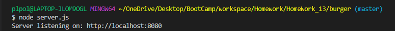
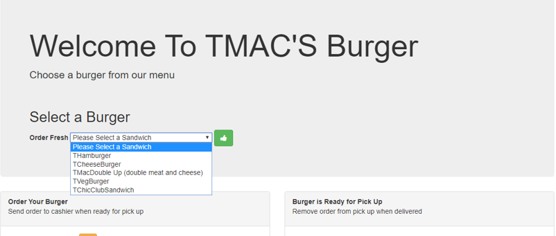
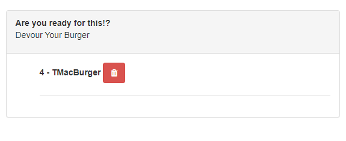

# TC-Eat-Da-Burger

### Overview

Using mSQL, Node, Express, Handlebars and a homemade ORM the TC-Eat-Da-Burger is a restaurant application that lets users input the names of burgers they'd like to eat. Once a burger name is entered a user is able to devour it the created burger. Using mySQL the status of each burger will be stored. 

### How To Access:

 -- Locally

To download the application onto your own machine please use https://github.com/TomaszChylinski/burger.git.

* Once cloned onto your machine, open the terminal of your choice to the following directory "burger"
* Run npm install (installs all dependecies)
* Using workbench create database using the schema found in the db directory 
* Open server.js in your terminal and run node server.js
* Visit your localhost please keep attention to the port you are using

-- Online

Please visit www.heroku.com (update link once its up on heroku)

# How to order a fresh burger

* From the drop down select a hamburger of your choice, once selected press on the green thumbs up icon to fullfill your order.

* Picking up your order, once added your burger will be ready for a pick up. Click on the fork and knife icon to pick up your order.

* Devour your burger! Once ready click on the grabage icon to devour your burger.

Thank you for viewing my TC-Eat-Da-Burger for any question please feel to visit my portfolio <a href="https://tomaszchylinski.github.io/chylinski-tomasz-portfolio/index.html">page</a>